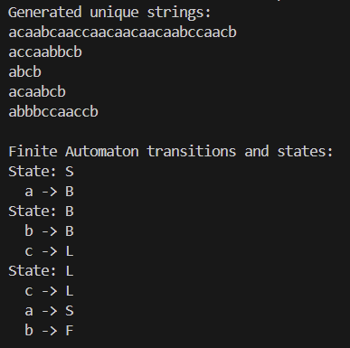

# Determinism in Finite Automata. Conversion from NDFA 2 DFA. Chomsky Hierarchy.
**Course**: Formal Languages & Finite Automata  
**Author**: Loredana Costin

---

## Theory

An automaton is a mathematical model of a finite-state machine. The state machine is a machine, which is having a set of input symbols, is jumping through the set of states, based on the transition functions.

There are 3 types of automata: DFA, NFA, and e-NFA. A deterministic finite automaton (DFA) is a finite state machine where for each state and input symbol, there is exactly one transition to another state. It is also a 5-tuple (states, alphabet, transition function, initial state, final states). A nondeterministic finite automaton (NFA) is a finite state machine where for each state and input symbol, there can be more than one transition to another state. It is also a 5-tuple, but at transition function, we have a subset of states. An e-NFA is a finite state machine where for each state and input symbol, there can be more than one transition to another state, but also there can be a transition to another state without consuming an input symbol.

We must pay attention that every NFA can be converted into an equivalent DFA, which means eliminating e-transitions, and convert simplified NFA.

The algorithm for converting an NFA to a DFA is the following:
1. Create state table from the given NDFA.
2. Create a blank state table under possible input alphabets for the equivalent DFA.
3. Mark the start state of the DFA by q0 (Same as the NDFA).
4. Find out the combination of States {q0, q1 ,... , qn} for each possible input alphabet.
5. Each time we generate a new DFA state under the input alphabet columns, we have to apply step 4 again, otherwise go to step 6.
6. The states which contain any of the final states of the NDFA are the final states of the equivalent DFA.

The algorithm for converting an e-NFA to a DFA is the following:
1. Find e-closure(s) of all states from NFA.
2. Draw the transition table.
3. Start computing the DFA table from the first state and take the resulting states as the next state in each step.
---

## Objectives:

- Understand what an automaton is and what it can be used for.
- Provide a function in your grammar type/class that could classify the grammar based on Chomsky hierarchy
- Get the finite automaton definition and do the following tasks:  
    a. Implement conversion of a finite automaton to a regular grammar.  
    b. Determine whether your FA is deterministic or non-deterministic.  
    c. Implement some functionality that would convert an NDFA to a DFA 
    d. Represent the finite automaton graphically (Optional, and can be considered as a bonus point):

---

## Implementation Description

1. **The Grammar class**  
   In this class, I implemented the logic for the Chomsky hierarchy, separing it in 4 types: Type-0, Type-1, Type-2, Type-3. 
First of all, it loops through the rules of the grammar, and checks if the non-terminal is in the non-terminals set. If it is not, then the grammar is of type 0. If it is, then it checks if the non-terminal has more than one symbol, and if it is not in the non-terminals set. If it is not, then the grammar is of type 2. If it is, then it checks if the production is empty, and if it is, then it continues to the next production. If it is not, then it checks if all the symbols in the production are in the terminals set. If they are, then it continues to the next production. If they are not, then it checks if the production has more than one symbol, and if the last symbol is in the non-terminals set. If it is, then the grammar is of type 3. If it is not, then the grammar is of type 1. If the grammar is not of type 0, 1, 2, or 3, then it is of type 4. 

    ```python
     for non_terminal, productions in self.rules.items():
            if non_terminal not in self.non_terminals:
                return "Type-0"  
            
            if len(non_terminal) != 1 or non_terminal not in self.non_terminals:
                is_type2 = False  

            for production in productions:
                if production == "":  
                    continue

                if all(symbol in self.terminals for symbol in production):
                    continue 
                
                if (len(production) >= 2 and 
                    all(symbol in self.terminals for symbol in production[:-1]) and 
                    production[-1] in self.non_terminals):
                    continue  
                
                is_type3 = False 

                lhs = non_terminal
                rhs = production
                if len(rhs) < len(lhs) or not any(symbol in self.non_terminals for symbol in rhs):
                    is_type1 = False
    ```


2. **The FiniteAutomaton class**
    In this case, I implemented the logic from a finite automaton to a regular grammar. I initialized the rules dictionary with 
the states as keys and an empty list as values. The dictionary rules stores the grammar rules where keys are non-terminals(states in FA), and values are lists of production rules. So, I looped through the transitions dictionary and added the transitions to the rules dictionary. Then, I added the final states to the rules dictionary. It also ensures that next_states is always a list. It is required because a DFA has a next state for each input symbol, but an NFA can have multiple next states for the same input symbol.
Each state will produce a terminal symbol followed by a non-terminal symbol. Final states in FA become ε-productions in RG. This ensures that a final state can produce an empty string (ε). The terminal symbol represents the input symbol, and the non-terminal symbol represents the next state.

    ```python
    def to_regular_grammar(self):
        from Grammar import Grammar 
        rules = {state: [] for state in self.states}

        for state, transitions in self.transitions.items():
            for symbol, next_states in transitions.items():
            # Ensure next_states is a list (for handling NFAs)
                if not isinstance(next_states, list):
                    next_states = [next_states]
                for next_state in next_states:
                    rules[state].append(f"{symbol} {next_state}")

        for final_state in self.final_states:
            rules[final_state].append("ε")  

        return Grammar(
            non_terminals=set(self.states),
            terminals=set(self.alphabet),
            start_symbol=self.start_state,
            rules=rules)
    ```
    
    Here, it is described the steps of finding out wether it's a DFA, NFA, or ε-NFA. I made sure to keep track wethere there are any epsilor transitions and if there are, it automatically is an e-NFA. I also recorded the symbols in a set to check if there are any repeated symbols. If there are, it is an NFA. If there are no epsilon transitions and there are no repeated symbols, it is a DFA.
    It's also crucial to ensure the next states are always a list, as an NFA can have multiple next states for the same input symbol.

    ```python
    def check_type(self):
        has_epsilon_transitions = False
        is_nfa = False

        for state, transitions in self.transitions.items():
            seen_symbols = set()
            for symbol, next_states in transitions.items():
                if symbol == "ε":
                    has_epsilon_transitions = True
                if not isinstance(next_states, list):
                    next_states = [next_states]
                if len(next_states) > 1 or symbol in seen_symbols:
                    is_nfa = True
                seen_symbols.add(symbol)
        if has_epsilon_transitions:
            return "ε-NFA"  # Special type of NFA
        elif is_nfa:
            return "NFA"
        else:
            return "DFA"
    ```

    I also implemented the logic for converting an NDFA to a DFA. I used the powerset construction algorithm to convert the NDFA
to a DFA. The algorithm works by creating a new state for each possible combination of states from the NDFA. The new state is a set of states from the NDFA. I made sure to work even for e-NFA, by adding the epsilon closure of the start state to the set of states. There is also included a variable for keeping tack of all discovered DFA states. So, I used a queue to keep track of the states that need to be processed. I also used a dictionary to keep track of the mapping between the DFA states and the NDFA states. So, it will iterate over each symbol in the alphabet, ignoring e transitions, because in DFA there do not exist. For handling new DFA states, it will be converted the set into an immutable frozenset, which is hashable and can be used as a dictionary key. It checks if it is a new DFA state, it will be assigned a new name and added to the dfa_states set and the queue for processing. If next_frozen_set exists, it will be stored the DFA transition. If any state in a DFA state set is an NFA final state, that DFA state becomes a final state.

    ```python
    dfa_transitions = {}
        start_closure = frozenset(self.epsilon_closure(self.start_state))
        dfa_states = {start_closure}
        state_mapping = {start_closure: "q0"}
        dfa_final_states = set()
        state_queue = [start_closure]
        while state_queue:
            current_set = state_queue.pop(0)
            dfa_transitions[state_mapping[current_set]] = {}
            for symbol in self.alphabet:
                if symbol == "ε":
                    continue
                next_set = set()
                for state in current_set:
                    if state in self.transitions and symbol in self.transitions[state]:
                        for next_state in self.transitions[state][symbol]:
                            next_set.update(self.epsilon_closure(next_state))
                next_frozen_set = frozenset(next_set)
                if next_frozen_set not in dfa_states and next_frozen_set:
                    state_mapping[next_frozen_set] = f"q{len(state_mapping)}"
                    dfa_states.add(next_frozen_set)
                    state_queue.append(next_frozen_set)
                if next_frozen_set:
                    dfa_transitions[state_mapping[current_set]][symbol] = state_mapping[next_frozen_set]
        for state_set in dfa_states:
            if any(state in self.final_states for state in state_set):
                dfa_final_states.add(state_mapping[state_set])
    ```


3. **The main script**
    In this part, I declared the specific grammar I had to work with, and made sure to not have the same string over and over again.

---
## Results and Conclusion

(outputs/lab1_FA.png)
In conclusion, I can say that the program worked as intended, the grammar was respected and the final state of each word was F, because there was only one final state due to a terminal symbol - L. This ensures the fact that all of the words generated belong to the same language. 

---
## References  

1. **Online Resources:**  
   - [Geeks for Geeks - NFA with epsilon move to DFA Conversion](https://www.geeksforgeeks.org/program-implement-nfa-epsilon-move-dfa-conversion/)  
   - [Intermation - A Quick Non-Deterministic to Deterministic Finite Automata Conversion](https://www.youtube.com/watch?v=N_N9Ky6tN_s&t=920s&ab_channel=Intermation)  
   -  [Geeks for Geeks - Chomsky Hierarchy in Theory of Computation](https://www.geeksforgeeks.org/chomsky-hierarchy-in-theory-of-computation/)

2. **Books and Slides:**  
   - [Automata Theory, Languages, & Computation - 3rd Edition (PDF)](https://mrce.in/ebooks/Automata%20Theory,%20Languages,%20&%20Computation%20Introduction%203rd%20Ed.pdf)  
   - [Course Slides (Google Drive)](https://drive.google.com/file/d/1rBGyzDN5eWMXTNeUxLxmKsf7tyhHt9Jk/view)  
