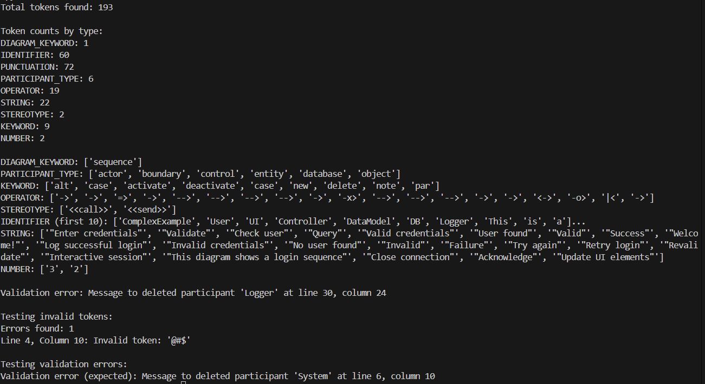

# Lexer & Scanner
**Course**: Formal Languages & Finite Automata  
**Author**: Loredana Costin

---

## Theory

Lexical tokenization is conversion of a text into (semantically or syntactically) meaningful lexical tokens belonging to categories defined by a "lexer" program. In case of a natural language, those categories include nouns, verbs, adjectives, punctuations etc. In case of a programming language, the categories include identifiers, operators, grouping symbols and data types. Lexical tokenization is related to the type of tokenization used in large language models (LLMs) but with two differences. First, lexical tokenization is usually based on a lexical grammar, whereas LLM tokenizers are usually probability-based. Second, LLM tokenizers perform a second step that converts the tokens into numerical values.

A rule-based program, performing lexical tokenization, is called tokenizer, or scanner, although scanner is also a term for the first stage of a lexer. A lexer forms the first phase of a compiler frontend in processing. Analysis generally occurs in one pass. Lexers and parsers are most often used for compilers, but can be used for other computer language tools, such as prettyprinters or linters. Lexing can be divided into two stages: the scanning, which segments the input string into syntactic units called lexemes and categorizes these into token classes, and the evaluating, which converts lexemes into processed values.

Lexical analysis is the first step of the compiler. It is the process of converting a sequence of characters into a sequence of tokens. A token is a sequence of characters that have a specific meaning in the language. For example, in the C programming language, the token for an integer constant is a sequence of digits.
---

## Objectives:

- Understand what lexical analysis is.
- Get familiar with the inner workings of a lexer/scanner/tokenizer.
- Implement a sample lexer and show how it works. In my case, i did a lexer for sequence diagrams.
---

## Implementation Description

1. **Token Definition**  
   

    ```python
     TOKEN_TYPES = {
    'DIAGRAM_KEYWORD': r'\b(sequence)\b',
    'PARTICIPANT_TYPE': r'\b(actor|object|boundary|control|entity|database)\b',
    'KEYWORD': r'\b(for|while|alt|opt|par|new|delete|activate|deactivate|note|case)\b',
    'OPERATOR': r'->|=>|-->|-x>|<->|-o>|\|<',
    'PUNCTUATION': r'[{}();:]',
    'STEREOTYPE': r'<<\s*(call|send|create|destroy|return)\s*>>',
    'IDENTIFIER': r'[a-zA-Z_][a-zA-Z0-9_]*',
    'STRING': r'"[^"]*"',
    'COMMENT': r'//.*|/\*.*?\*/',
    'NUMBER': r'\d+',
    'WHITESPACE': r'\s+'}
    ```
This dictionary defines all the token types the lexer recognizes, with each key being a token type and each value being a regular expression pattern that matches tokens of that type. The patterns are carefully ordered to ensure correct tokenization:

    - **DIAGRAM_KEYWORD**: Matches the keyword "sequence"
    - **PARTICIPANT_TYPE**: Matches the keywords "actor", "object", "boundary", "control", "entity", and "database"
    - **KEYWORD**: Matches the keywords "for", "while", "alt", "opt", "par", "new", "delete", "activate", "deactivate", "note", and "case"
    - **OPERATOR**: Matches the operators "->", "=>", "-->", "-x>", "<->", and "-o>"
    - **PUNCTUATION**: Matches the punctuation symbols "{}", "()", ";", and ":"
    - **STEREOTYPE**: Matches the stereotype keywords "call", "send", "create", "destroy", and "return"
    - **IDENTIFIER**:
    Matches identifiers, which start with a letter or underscore and can be followed by any number of letters, digits, or underscores.
    - **STRING**: Matches strings, which are sequences of characters enclosed in double quotes.
    - **COMMENT**: Matches single-line and multi-line comments.
    - **NUMBER**: Matches numbers, which are sequences of one or more digits.
    - **WHITESPACE**: Matches whitespace characters, which include spaces, tabs, and newlines.
    The order of the patterns is important because the lexer will try to match the input string against each pattern in order until it finds a match. If no match is found, the lexer will raise a TokenizationError.

2. **The tokenization process**
    First of all, we need a  position variable to keep track of where it is in the input text. The main loop continues until it has processed the entire input text, character by character. For each character in the input text, it checks if the current position is at the end of the input text. If it is, it breaks out of the loop. Otherwise, it checks if the current character is a whitespace character. If it is, it increments the position variable and continues to the next character. If the current character is not a whitespace character, it checks if the current position is at the end of the input text. If it is, it breaks out of the loop. Otherwise, it checks if the current character is a digit. If it is, it checks if the next character is also a digit. If it is, it appends the current character to the current token and increments the position variable. If the next character is not a digit, it appends the current character to the current token and breaks out of the loop. If the current character is not a digit, it checks if the current character is a letter. If it is, it checks if the next character is also a letter. If it is, it appends the current character to the current token and increments the position variable. If the next character is not a letter, it appends the current character to the current token and breaks out of the loop. If the current character
    ```python
        position = 0
        while position < len(self.input_text):
            if self.input_text[position].isspace():
                if self.input_text[position] == '\n':
                    self.current_line += 1
                    self.current_column = 1
                else:
                    self.current_column += 1
                position += 1
                continue
            
            match = None
            for token_type, pattern in TOKEN_TYPES.items():
                regex = re.compile(pattern)
                match_obj = regex.match(self.input_text[position:])
                if match_obj:
                    match = (token_type, match_obj.group(0))
                    break
            
            if not match:
                invalid_end = position
                while (invalid_end < len(self.input_text) and 
                       not self.input_text[invalid_end].isspace() and 
                       self.input_text[invalid_end] not in '{}();:'):
                    invalid_end += 1
                
                invalid_token = self.input_text[position:invalid_end]
                self.errors.append({
                    'message': f"Invalid token: '{invalid_token}'",
                    'line': self.current_line,
                    'column': self.current_column
                })
                
                self.current_column += invalid_end - position
                position = invalid_end
                continue
            
            token_type, value = match
            
            if token_type == 'COMMENT':
                for char in value:
                    if char == '\n':
                        self.current_line += 1
                        self.current_column = 1
                    else:
                        self.current_column += 1
                position += len(value)
                continue
            
            if token_type == 'WHITESPACE':
                for char in value:
                    if char == '\n':
                        self.current_line += 1
                        self.current_column = 1
                    else:
                        self.current_column += 1
                position += len(value)
                continue
            
            self.tokens.append({
                'type': token_type,
                'value': value,
                'line': self.current_line,
                'column': self.current_column
            })
            
            self.current_column += len(value)
            position += len(value)
        
        return self.tokens
    ```
    
3. **The validation process**
    Here, we thought about iteration through all tokens to build up the participant registry and track control structures. We also need to check for invalid tokens and report errors.
    ```python
    if token['type'] == 'PARTICIPANT_TYPE':
    j = i + 1
    while j < len(self.tokens) and self.tokens[j]['type'] in ['WHITESPACE', 'COMMENT']:
        j += 1
    
    if j < len(self.tokens):
        if self.tokens[j]['type'] == 'IDENTIFIER':
            participant_name = self.tokens[j]['value']
            participants[participant_name] = 'active'
        elif self.tokens[j]['type'] == 'STRING':
            participant_name = self.tokens[j]['value'].strip('"')
            participants[participant_name] = 'active'

    ```
    This section handles participant declarations:

1. When a participant type token (actor, object, etc.) is found, it looks ahead to find the participant name
It skips any whitespace or comments between the type and name
2. If the next token is an identifier or string, it extracts the participant name
3. It adds the participant to the tracking dictionary with state 'active'
This allows the validator to know which participants exist in the diagram.
    ```python
    if token['type'] == 'PARTICIPANT_TYPE':
    j = i + 1
    while j < len(self.tokens) and self.tokens[j]['type'] in ['WHITESPACE', 'COMMENT']:
        j += 1
    
    if j < len(self.tokens):
        if self.tokens[j]['type'] == 'IDENTIFIER':
            participant_name = self.tokens[j]['value']
            participants[participant_name] = 'active'
        elif self.tokens[j]['type'] == 'STRING':
            participant_name = self.tokens[j]['value'].strip('"')
            participants[participant_name] = 'active'

    ```
   In the next section, we have the lifecycle changing:
1. For the 'new' keyword: It looks at the previous token to find the participant name. It also marks that participant as 'active' in the tracking dictionary
2. For the 'delete' keyword: It looks at the previous token to find the participant name. It also marks that participant as 'deleted' in the tracking dictionary

This allows the validator to know when participants are created or destroyed during the sequence.

    ```python
    elif token['type'] == 'KEYWORD':
    if token['value'] == 'new':
        if i > 0 and self.tokens[i-1]['type'] == 'IDENTIFIER':
            participant_name = self.tokens[i-1]['value']
            participants[participant_name] = 'active'
    
    elif token['value'] == 'delete':
        if i > 0 and self.tokens[i-1]['type'] == 'IDENTIFIER':
            participant_name = self.tokens[i-1]['value']
            participants[participant_name] = 'deleted'

    ```
    In the next section, we have the control structure validation: When a control structure keyword (for, while, alt, etc.) is encountered: it will the keyword onto the control stack When a closing brace ('}') is encountered: it will pop the most recent control structure from the stack

    ```python
    elif token['value'] in ['for', 'while', 'alt', 'opt', 'par']:
    control_stack.append(token['value'])

    elif token['type'] == 'PUNCTUATION' and token['value'] == '}':
    if control_stack:
        control_stack.pop()

    ```
In the next section, we have the message validation: If both sender and receiver are found, then we see 
if the sender is not in the participants dictionary, it adds it as 'active' (implicit declaration)
If the sender is marked as 'deleted', it raises an error (can't send messages from deleted participants).
If the receiver is not in the participants dictionary, it adds it as 'active' (implicit declaration).
If the receiver is marked as 'deleted', it raises an error (can't send messages to deleted participants)
This enforces the rule that deleted participants cannot participate in message exchanges.

    ```python
    if sender and receiver:
    if sender not in participants:
        participants[sender] = 'active'
    
    if participants.get(sender) == 'deleted':
        raise ValueError(f"Message from deleted participant '{sender}' at line {token['line']}, column {token['column']}")
    
    if receiver not in participants:
        participants[receiver] = 'active'
    
    if participants.get(receiver) == 'deleted':
        raise ValueError(f"Message to deleted participant '{receiver}' at line {token['line']}, column {token['column']}")
    ```

    Finally, the method checks if any errors were recorded during tokenization:

1. If there are errors, it formats them into a multi-line string with line and column information
2. It raises a ValueError with all the error messages
This ensures that any syntax errors detected during tokenization are reported along with semantic errors.

    ```python
    if self.errors:
    error_messages = "\n".join([f"Line {e['line']}, Column {e['column']}: {e['message']}" for e in self.errors])
    raise ValueError(f"Validation errors:\n{error_messages}")
    ```

---
## Results and Conclusion


In conclusion, I can say that the lexer successfully processed a complex sequence diagram, identifying 193 tokens across 9 different token types.
Strengths:
1. Token Recognition: The lexer correctly identified all token types defined in the language specification;
2. Error Detection: The lexer successfully detected invalid tokens (like @#$) and provided precise error messages with line and column information.
3. Semantic Validation: The validation logic correctly identified semantic errors, such as attempts to send messages to deleted participants (Logger and System).
4. Detailed Position Tracking: The lexer accurately tracked line and column positions throughout the tokenization process, enabling precise error reporting.
---
## References  

1. **Online Resources:**  
   - [Wikipedia - Lexical analysis](https://en.wikipedia.org/wiki/Lexical_analysis)  
   - [stlab - how to write a simple lexical analyzer or parser](https://stlab.cc/legacy/how-to-write-a-simple-lexical-analyzer-or-parser.html)  
   -  [Make your own programming language - lexer](https://www.youtube.com/watch?v=Eythq9848Fg&ab_channel=CodePulse)

2. **Books and Slides:**  
   - [Automata Theory, Languages, & Computation - 3rd Edition (PDF)](https://mrce.in/ebooks/Automata%20Theory,%20Languages,%20&%20Computation%20Introduction%203rd%20Ed.pdf)  
   - [Course Slides (Google Drive)](https://drive.google.com/file/d/1rBGyzDN5eWMXTNeUxLxmKsf7tyhHt9Jk/view)  
