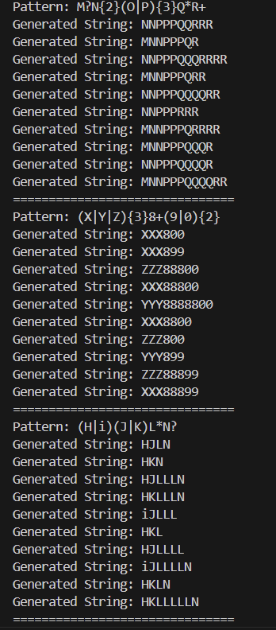
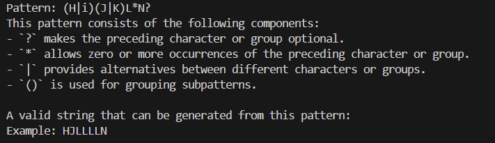

# Regular expressions
**Course**: Formal Languages & Finite Automata  
**Author**: Loredana Costin

---

## Theory

Regular expressions are a powerful tool for pattern matching in text data. They are widely used in various programming languages and tools for tasks such as text processing, data validation, and more. It can also be thought as an algebraic description of DFA and NDFA. With other words said, it is a sequence of characters that form a search pattern.

Regular expressions are formed using the following rules:
1. The symbols (`&epsilon`), and `&empty` are regular expressions.
2. Every 'a' in the alphabet is a regular expression.
3. If 'R' and 'S' are regular expressions, then so are 'RS', 'R+S', 'R*'.

Most formalisms provide the following operations to construct regular expressions:
1. Boolean 'or': A vertical bar separates alternatives. For example, gray|grey can match "gray" or "grey".
2. Grouping: Parentheses can be used to group subexpressions. For example, gray|grey and gr(a|e)y are equivalent patterns which both describe the set of "gray" or "grey".
3. Quantification: A quantifier after an element (such as a token, character, or group) specifies how many times the preceding element is allowed to repeat. The most common quantifiers are the question mark ? (indicates zero or one occurrences of the preceding element), the asterisk *(zero or more occurrences of the preceding element), and the plus sign +(one or more occurrences of the preceding element) .
4. Wildcard: The wildcard . matches any character. For example, a.b matches any string that contains an "a", and then any character and then "b". a.*b matches any string that contains an "a", and then the character "b" at some later point.

Remember: 
1. a language is always regular if it is represented by a regular expression;
2. the set represented by R is denoted as L(R);
3. regular expressions represented in a regular set as : a -> {a}, a+b+c -> {a, b, c}, ab+ba = {ab, ba},
ab(d+e) -> {abd, abe}, a* -> {(`&epsilon`), a, aa, aaa, ...}, (a+b)* -> {(`&epsilon`), a, b, aa, ab, ba, bb, aaa, aab, aba, abb, baa, bab, bba, bbb, ...}


Regular expressions to NFA:
1. `&empty` is the initial state;
2. (`&epsilon`) is the final state and the initial state of the NFA;

Implementing regular expressions in python, we basically need a method re.search(pattern, string) which returns a match object if the pattern is found in the string. If not, it returns None.

---

## Objectives:

- Write and cover what regular expressions are, what they are used for;
- Below you will find 3 complex regular expressions per each variant. Take a variant depending on your number in the list of students and do the following:
    a. Write a code that will generate valid combinations of symbols conform given regular expressions (examples will be shown).
    b. In case you have an example, where symbol may be written undefined number of times, take a limit of 5 times (to evade generation of extremely long combinations);
    c. Bonus point: write a function that will show sequence of processing regular expression (like, what you do first, second and so on)
---

## Implementation Description

1. **Pattern declaration**  
   

    ```python
     patterns = [
        r"M?N{2}(O|P){3}Q*R+",
        r"(Z|Y|Z){3}8+(9|0){2}",
        r"(H|i)(J|K)L*N?"
    ]
    ```
In order for our code to work, we need to declare the patterns we want to use. We can do this by creating a list of regular expressions. Each regular expression represents a pattern that we want to match.

2. **The generation of random strings and their validation**

This segment of code represents how it is generated random string from regular expressions. It begins with a while loop that will iterate over the pattern. If it is encountered '\\', it increments and it is checked the next character. When encountering \d, the code understands this represents any digit, meaning that it randomly chooses a digit (0-9) to represent this class. For \w, which represents any word character, the algorithm performs a more elaborate selection—choosing from letters (both uppercase and lowercase), digits, and the underscore. When \s appears, signifying whitespace, the code selects from the various whitespace characters—spaces, tabs, newlines.


```python
    while i < len(pattern):
            char = pattern[i]
            
            if char == '\\' and i + 1 < len(pattern):
                i += 1
                char = pattern[i]
                if char == 'd':  
                    result.append(str(random.randint(0, 9)))
                elif char == 'w': 
                    result.append(random.choice('abcdefghijklmnopqrstuvwxyzABCDEFGHIJKLMNOPQRSTUVWXYZ0123456789_'))
                elif char == 's':  
                    result.append(random.choice(' \t\n\r\f\v'))
                else:  
                    result.append(char)
                i += 1
                continue
```


```python
 if char == '[':
                end = pattern.find(']', i)
                if end != -1:
                    char_class = pattern[i+1:end]
                    negated = char_class.startswith('^')
                    if negated:
                        char_class = char_class[1:]
                    
                    chars_to_choose = []
                    j = 0
                    while j < len(char_class):
                        if j + 2 < len(char_class) and char_class[j+1] == '-':
                            chars_to_choose.extend(chr(c) for c in range(ord(char_class[j]), ord(char_class[j+2]) + 1))
                            j += 3
                        else:
                            chars_to_choose.append(char_class[j])
                            j += 1
                    
                    if negated:
                        all_chars = [chr(c) for c in range(32, 127)]
                        chars_to_choose = [c for c in all_chars if c not in chars_to_choose]
                    
                    result.append(random.choice(chars_to_choose))
                    i = end + 1
                    continue
```

```python
f char in '*+?{' and result:
                last_result = result.pop()
                count = 1
                if char == '*':
                    count = random.randint(0, 5)
                elif char == '+':
                    count = random.randint(1, 5)
                elif char == '?':
                    count = random.randint(0, 1)
                elif char == '{':
                    end_brace = pattern.find('}', i)
                    if end_brace != -1:
                        count_spec = pattern[i+1:end_brace]
                        if ',' in count_spec:
                            min_count, max_count = count_spec.split(',')
                            min_count = int(min_count) if min_count else 0
                            max_count = int(max_count) if max_count else 10
                            count = random.randint(min_count, max_count)
                        else:
                            count = int(count_spec)
                        i = end_brace
                result.append(last_result * count)
```
    
3. **The explanation of the process of creating strings out of regular expressions**

For explaining the process of creating strings out of regular expressions, I did a list of explanations for each pattern. If the component is numeric, it returns a message that matches the digit. If the component is not in the list, it returns a message that the component is unknown.

```python
if '?' in pattern:
        explanation += "- `?` makes the preceding character or group optional.\n"
    if '*' in pattern:
        explanation += "- `*` allows zero or more occurrences of the preceding character or group.\n"
    if '+' in pattern:
        explanation += "- `+` requires at least one occurrence of the preceding character or group.\n"
    if '{' in pattern:
        explanation += "- `{n,m}` specifies a minimum and maximum number of repetitions.\n"
    if '|' in pattern:
        explanation += "- `|` provides alternatives between different characters or groups.\n"
    if '(' in pattern and ')' in pattern:
        explanation += "- `()` is used for grouping subpatterns.\n"
    if '[' in pattern and ']' in pattern:
        explanation += "- `[]` defines a character class, selecting one character from the given options.\n"
    
    explanation += "\nA valid string that can be generated from this pattern:\n"
    example_string = generate_string_from_pattern(pattern)
    explanation += f"Example: {example_string}\n"
```


---
## Results and Conclusion



In conclusion, I can say that the strings were generated correctly from the given regular expressions. The most complicated part was the one to think about a general explanation of every possible string generated from a random regular expression. By breaking down each pattern into smaller components and explaining the process step-by-step, the code successfully maps the match process in a clear and understandable way. The generated strings were validated and matched the regular expressions, as evidenced by the output images provided, which show how different patterns yield various types of strings


---
## References  

1. **Online Resources:**  
   - [Wikipedia - Regular expression](https://en.wikipedia.org/wiki/Regular_expression#Implementations_and_running_times)  
   - [GeeksForGeeks - how to write regular expressions](https://www.geeksforgeeks.org/write-regular-expressions/)  
   -  [Google for Education- Python regular expressions](https://developers.google.com/edu/python/regular-expressions)

2. **Books and Slides:**  
   - [Automata Theory, Languages, & Computation - 3rd Edition (PDF)](https://mrce.in/ebooks/Automata%20Theory,%20Languages,%20&%20Computation%20Introduction%203rd%20Ed.pdf)  
   - [Course Slides (Google Drive)](https://drive.google.com/file/d/1UuQZz-xybc4JhTnm_RgCvybvmnrqGfG2/view)  
