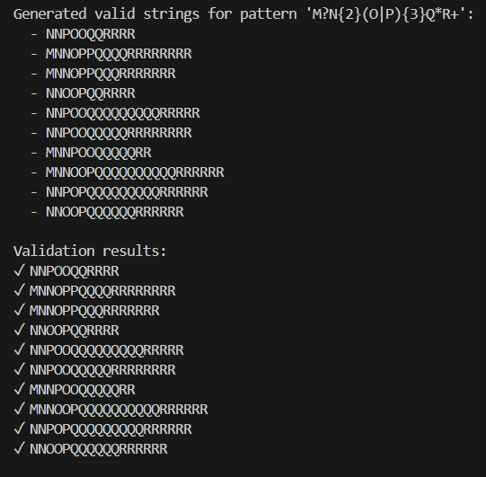
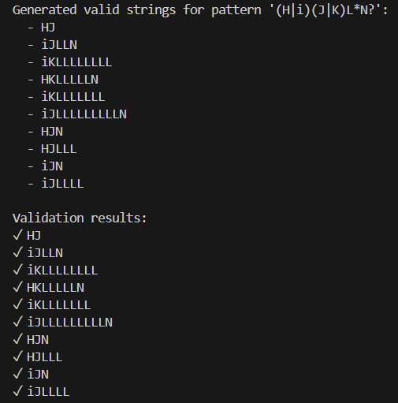
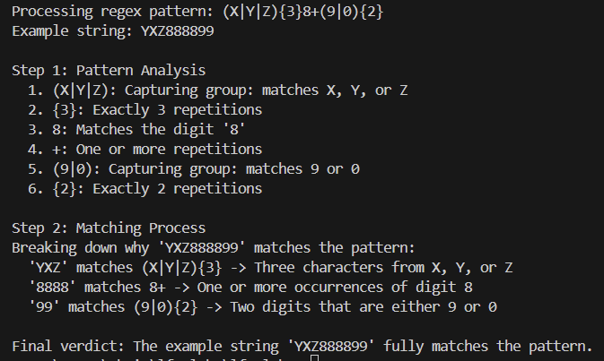

# Regular expressions
**Course**: Formal Languages & Finite Automata  
**Author**: Loredana Costin

---

## Theory

Regular expressions are a powerful tool for pattern matching in text data. They are widely used in various programming languages and tools for tasks such as text processing, data validation, and more. It can also be thought as an algebraic description of DFA and NDFA. With other words said, it is a sequence of characters that form a search pattern.

Regular expressions are formed using the following rules:
1. The symbols (`&epsilon`), and `&empty` are regular expressions.
2. Every 'a' in the alphabet is a regular expression.
3. If 'R' and 'S' are regular expressions, then so are 'RS', 'R+S', 'R*'.

Most formalisms provide the following operations to construct regular expressions:
1. Boolean 'or': A vertical bar separates alternatives. For example, gray|grey can match "gray" or "grey".
2. Grouping: Parentheses can be used to group subexpressions. For example, gray|grey and gr(a|e)y are equivalent patterns which both describe the set of "gray" or "grey".
3. Quantification: A quantifier after an element (such as a token, character, or group) specifies how many times the preceding element is allowed to repeat. The most common quantifiers are the question mark ? (indicates zero or one occurrences of the preceding element), the asterisk *(zero or more occurrences of the preceding element), and the plus sign +(one or more occurrences of the preceding element) .
4. Wildcard: The wildcard . matches any character. For example, a.b matches any string that contains an "a", and then any character and then "b". a.*b matches any string that contains an "a", and then the character "b" at some later point.

Remember: 
1. a language is always regular if it is represented by a regular expression;
2. the set represented by R is denoted as L(R);
3. regular expressions represented in a regular set as : a -> {a}, a+b+c -> {a, b, c}, ab+ba = {ab, ba},
ab(d+e) -> {abd, abe}, a* -> {(`&epsilon`), a, aa, aaa, ...}, (a+b)* -> {(`&epsilon`), a, b, aa, ab, ba, bb, aaa, aab, aba, abb, baa, bab, bba, bbb, ...}


Regular expressions to NFA:
1. `&empty` is the initial state;
2. (`&epsilon`) is the final state and the initial state of the NFA;

Implementing regular expressions in python, we basically need a method re.search(pattern, string) which returns a match object if the pattern is found in the string. If not, it returns None.

---

## Objectives:

- Write and cover what regular expressions are, what they are used for;
- Below you will find 3 complex regular expressions per each variant. Take a variant depending on your number in the list of students and do the following:
    a. Write a code that will generate valid combinations of symbols conform given regular expressions (examples will be shown).
    b. In case you have an example, where symbol may be written undefined number of times, take a limit of 5 times (to evade generation of extremely long combinations);
    c. Bonus point: write a function that will show sequence of processing regular expression (like, what you do first, second and so on)
---

## Implementation Description

1. **Pattern declaration**  
   

    ```python
     patterns = [
        r"M?N{2}(O|P){3}Q*R+",
        r"(Z|Y|Z){3}8+(9|0){2}",
        r"(H|i)(J|K)L*N?"
    ]
    ```
In order for our code to work, we need to declare the patterns we want to use. We can do this by creating a list of regular expressions. Each regular expression represents a pattern that we want to match.

2. **The generation of random strings and their validation**
First of all, I observed the fact that in my pattern, there were characters that might repeat 0, 1 or more times. Therefore, I had to generate just 10 possible strings. In order to do so, I did a loop that will generate 10 random strings depending on the pattern we want to match. For example, if we want to match the pattern M?N{2}(O|P){3}Q*R+, we will generate 10 random strings that will match the pattern. After generating the random strings, we need to validate them. We can do this by using the re.match() function. This function will return a match object if the string matches the pattern. If not, it will return None.

```python
    def generate_valid_strings(pattern, count=10):
    results = []

    for _ in range(count):
        if pattern == r"M?N{2}(O|P){3}Q*R+":
            m_part = random.choice(['', 'M'])
            n_part = 'NN'
            op_part = ''.join(random.choices(['O', 'P'], k=3))
            q_part = 'Q' * random.randint(0, 10)
            r_part = 'R' * random.randint(1, 10)
            results.append(m_part + n_part + op_part + q_part + r_part)

        elif pattern == r"(X|Y|Z){3}8+(9|0){2}":
            xzy_part = ''.join(random.choices(['X', 'Y', 'Z'], k=3))
            eight_count = random.randint(1, 10)
            eight_part = '8' * eight_count
            end_part = ''.join(random.choices(['9', '0'], k=2))
            results.append(xzy_part + eight_part + end_part)

        elif pattern == r"(H|i)(J|K)L*N?":
            first = random.choice(['H', 'i'])
            second = random.choice(['J', 'K'])
            l_part = 'L' * random.randint(0, 10)
            n_part = 'N' if random.choice([True, False]) else ''
            results.append(first + second + l_part + n_part)

    return results

def validate_strings(pattern, strings):
    compiled_pattern = re.compile(f"^{pattern}$")
    return [(string, bool(compiled_pattern.match(string))) for string in strings]
```
    
3. **The explanation of the process of creating strings out of regular expressions**

For explaining the process of creating strings out of regular expressions, I did a list of explanations for each pattern. If the component is numeric, it returns a message that matches the digit. If the component is not in the list, it returns a message that the component is unknown.

```python
explanations = {
        '.': "Any character except a newline",
        '*': "Zero or more repetitions",
        '+': "One or more repetitions",
        '?': "Zero or one repetition",
        '\\d': "A digit (0-9)",
        '\\w': "A word character (alphanumeric + underscore)",
        '{3}': "Exactly 3 repetitions",
        '{2}': "Exactly 2 repetitions",
        '8': "Matches the digit 8",
        '(X|Y|Z)': "Capturing group: matches X, Y, or Z",
        '(9|0)': "Capturing group: matches 9 or 0"
    }
if component.isnumeric():
        return f"Matches the digit '{component}'"
    return explanations.get(component, f"Unknown component: {component}")
```

Here, I did a function which breaks down the pattern into its individual components. The function re.findall is used to find all the components in the pattern. The function returns a list of components. 

```python
def break_down_pattern(pattern):
    components = re.findall(r'\(.*?\)|\[.*?\]|\{\d+,?\d*\}|\\?.', pattern)
    return components
```

Here, I chose to do components which call a function that breaks down the pattern into its individual components. 
Here, I chose to have an example string, randomly generated to demonstrate the matching process. 
I also declared the step 1, which is the pattern analysis. 

```python
 components = break_down_pattern(pattern)
    example_string = generate_valid_strings(pattern, count=1)[0]
    print(f"\nProcessing regex pattern: {pattern}")
    print(f"Example string: {example_string}\n")

    print("Step 1: Pattern Analysis")
    for idx, component in enumerate(components, 1):
        explanation = explain_component(component)
        print(f"  {idx}. {component}: {explanation}")
```


Then, I created all of the 3 patterns, if its the first pattern, then it displays the message for the first pattern. Announces it will break down why the example string matches the pattern. It also checks if the current pattern is the specific one it knows how to explain. If so, it divides the matching process into three parts:

```python
print("\nStep 2: Matching Process")
    print(f"Breaking down why '{example_string}' matches the pattern:")
    
    if pattern == r"(X|Y|Z){3}8+(9|0){2}":
        first_part = example_string[:3]
        print(f"  '{first_part}' matches (X|Y|Z){{3}} -> Three characters from X, Y, or Z")
        pos = 3
        while pos < len(example_string) and example_string[pos] == '8':
            pos += 1
        
        middle_part = example_string[3:pos]
        print(f"  '{middle_part}' matches 8+ -> One or more occurrences of digit 8")
        
        last_part = example_string[pos:]
        print(f"  '{last_part}' matches (9|0){{2}} -> Two digits that are either 9 or 0")
```


---
## Results and Conclusion





In conclusion, I can say that the strings were generated correctly from the given regular expressions. The most complicated part was the one to think about a general explanation of every possible string generated from a random regular expression. By breaking down each pattern into smaller components and explaining the process step-by-step, the code successfully maps the match process in a clear and understandable way. The generated strings were validated and matched the regular expressions, as evidenced by the output images provided, which show how different patterns yield various types of strings


---
## References  

1. **Online Resources:**  
   - [Wikipedia - Regular expression](https://en.wikipedia.org/wiki/Regular_expression#Implementations_and_running_times)  
   - [GeeksForGeeks - how to write regular expressions](https://www.geeksforgeeks.org/write-regular-expressions/)  
   -  [Google for Education- Python regular expressions](https://developers.google.com/edu/python/regular-expressions)

2. **Books and Slides:**  
   - [Automata Theory, Languages, & Computation - 3rd Edition (PDF)](https://mrce.in/ebooks/Automata%20Theory,%20Languages,%20&%20Computation%20Introduction%203rd%20Ed.pdf)  
   - [Course Slides (Google Drive)](https://drive.google.com/file/d/1UuQZz-xybc4JhTnm_RgCvybvmnrqGfG2/view)  
