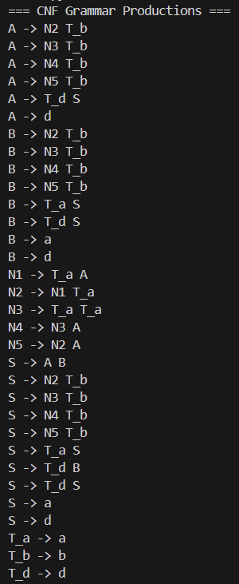
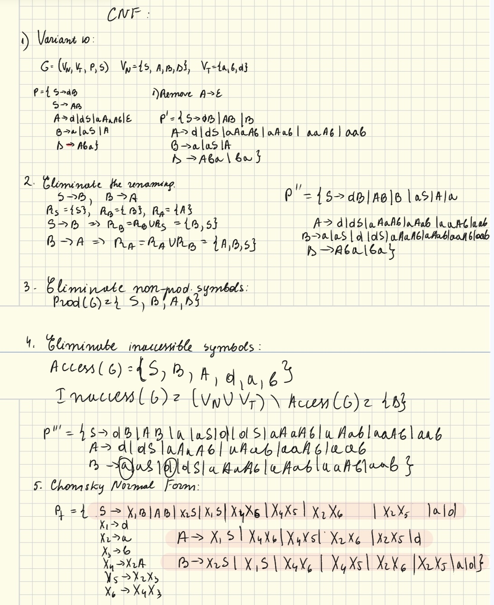

# Chomsky Normal Form
**Course**: Formal Languages & Finite Automata  
**Author**: Loredana Costin

---

## Theory

Chomsky Normal Form (CNF) is a restricted form of context-free grammars (CFGs) where every production rule adheres to a specific structure. CNF is important because it simplifies parsing algorithms (like the CYK algorithm) and theoretical proofs in automata theory.

A CFG is in Chomsky Normal Form if all its production rules are of one of the following forms:

1. non-terminal -> terminal (A->a);
2. non-terminal -> 2 non-terminals (A->BC);
3. special case for the start symbol: S->`&epsilon`;

Key restrictions in CNF:
1. no unit productions (like A-> B);
2. No mixed productions (like A->aB);
3. No productions with more than two non-terminals on the right-hand side (RHS).

Steps to convert a CFG into CNF:
1. Eliminate `&epsilon`-Productions (Nullable Non-terminals). Identify all non-terminals that can derive `&epsilon`. For each production A -> `&alpha`, add new productions where nullable non-terminals are removed in all possible combinations.
2. Eliminate Unit Productions (A → B). If A→B and B→`&alpha`, replace A→B with A→`&alpha`. Repeat until no unit productions remain.
3. Eliminate Non-Terminals Mixed with Terminals. Replace terminals in productions with more than one symbol using new non-terminals. For every terminal a, introduce a new rule T→a.
4. Break Long Productions into Pairs of Non-Terminals. Break Long Productions into Pairs of Non-Terminals. A->BCD. Then A-> BE, where E-> CD.

The reason to use CNF:
1. Simplifies Parsing: The CYK algorithm (used for membership testing) requires CNF.
2. Easier Proofs: Many theoretical results (e.g., pumping lemma for CFLs) assume CNF.
3. Removes Ambiguity: Helps in reducing structural ambiguity in grammars.
---

## Objectives:

- Learn about Chomsky Normal Form (CNF).
- Get familiar with the approaches of normalizing a grammar.
- Implement a method for normalizing an input grammar by the rules of CNF.
    a. The implementation needs to be encapsulated in a method with an appropriate signature (also ideally in an appropriate class/type).
    b. The implemented functionality needs executed and tested.
    c. Also, another BONUS point would be given if the student will make the aforementioned function to accept any grammar, not only the one from the student's variant.
---

## Implementation Description

1. **Removing null productions**  

This section is concerned with finding all nullable non-terminals and generating all variations of existing rules with nullable symbols removed.

```python
nullable = set(k for k, productions in self.grammar.items() if [] in productions) 
```
Then, it finds all non-terminals that can directly derive `&epsilon`. Checks each production (prod) of non-terminals (k). If all symbols in a production are nullable, then k is also nullable. The loop continues until no new nullable non-terminals are found (changed = False). 
```python
while changed:
            changed = False
            for k, productions in self.grammar.items():
                if k not in nullable:
                    for prod in productions:
                        if all(symbol in nullable for symbol in prod):
                            nullable.add(k)
                            changed = True
                            break
```

It also creates new productions by omitting nullable symbols in all possible combinations. For each production (prod), recursively generates all possible combinations where nullable symbols are removed. 
```python
    self._add_combinations(k, prod, 0, [], nullable, new_grammar)         
```

2. **Removing the unit productions**

It identifies all unit productions. It begins with initialization of unit_pairs with reflexive pairs ((A, A)). If a production has length 1 and is a non-terminal, it is added to unit_pairs.

```python
        unit_pairs = {(k, k) for k in self.grammar}

        for k, productions in self.grammar.items():
            for prod in productions:
                if len(prod) == 1 and prod[0] in self.grammar:
                    unit_pairs.add((k, prod[0]))
```

Then, it computes the transitive closure of unit pairs to find all indirect unit derivations:
If (A → B) and (B → C) exist, then (A → C) is added. This ensures all possible unit chains are resolved.

```python
        while changed:
            changed = False
            new_pairs = set()
            for a, b in unit_pairs:
                for c in self.grammar:
                    if (b, c) in unit_pairs and (a, c) not in unit_pairs:
                        new_pairs.add((a, c))
                        changed = True
            unit_pairs.update(new_pairs)
```

Finally, unit productions are replaced with their non-unit expansions: For each unit pair (A, B), all non-unit productions from B are copied to A. Duplicates are avoided by checking if the production already exists in new_grammar[a].

```python
        new_grammar = {k: [] for k in self.grammar}
        for a, b in unit_pairs:
            if a != b:
                for prod in self.grammar[b]:
                    if len(prod) != 1 or prod[0] not in self.grammar:
                        if prod not in new_grammar[a]:
                            new_grammar[a].append(prod)
```

3. **Replace terminals in long rules**

CNF requires that productions with more than one symbol on the RHS must consist solely of non-terminals. This step ensures terminals in long productions are replaced with new non-terminals. For each terminal in a long production, a new non-terminal is introduced: A mapping (terminal_map) stores the association between terminals and their corresponding new non-terminals (e.g., a → T_a). The new rule T_a → a is added to new_rules.

```python
 if symbol not in self.grammar:
    if symbol not in self.terminal_map:
        t_name = f"T_{symbol}"
        self.terminal_map[symbol] = t_name
        self.new_rules.setdefault(t_name, [])
        if [symbol] not in self.new_rules[t_name]:
            self.new_rules[t_name].append([symbol])
    new_prod.append(self.terminal_map[symbol])
```
Then, the new terminal rules are merged into the main grammar, ensuring that all introduced rules are included in the grammar.


```python
 for k, v in self.new_rules.items():
            self.grammar.setdefault(k, [])
            for rule in v:
                if rule not in self.grammar[k]:
                    self.grammar[k].append(rule)
        self.new_rules = {}
```
                        
    
4. **The process of having unique procution rules**

In order to get uniquely production rules, it must continuously try to identify and consolidate nonterminal symbols in a grammar that are structurally equivalent. It begins by generating a *signature* for each nonterminal based on its productions, categorizing them as either binary (two elements) or unary (one element), and capturing certain properties about their structure. These signatures are grouped together to find nonterminals that share the same production patterns. Then, it further checks if the actual production patterns (not just their structural type) are identical among those nonterminals. If so, it selects one representative nonterminal (the first in the group) and maps the rest to it as substitutions, excluding the grammar’s start symbol. This process allows the grammar to be simplified by eliminating redundant or equivalent nonterminals. The loop continues indefinitely, implying that this might be part of a larger system that applies substitutions or breaks based on some condition outside the snippet.

```python
 while True:
            signatures = {}
            for nt, productions in self.grammar.items():
                sig_parts = []
                for prod in productions:
                    if len(prod) == 2:
                        pattern = ("BIN", prod[0] in self.grammar, prod[1] in self.grammar, prod[0] == prod[1])
                    elif len(prod) == 1:
                        pattern = ("UNARY", prod[0] not in self.grammar)
                    else:
                        continue
                    sig_parts.append(pattern)

                signature = frozenset(sig_parts)
                signatures.setdefault(signature, []).append(nt)

            substitutions = {}
            for sig, nts in signatures.items():
                if len(nts) > 1 and sig:
                    pattern_groups = {}
                    for nt in nts:
                        patterns = [tuple(prod) for prod in self.grammar[nt]]
                        pattern_key = frozenset(patterns)
                        pattern_groups.setdefault(pattern_key, []).append(nt)

                    for group in pattern_groups.values():
                        if len(group) > 1:
                            keep = group[0]
                            for replace in group[1:]:
                                if replace != self.start_symbol:
                                    substitutions[replace] = keep
```


---
## Results and Conclusion



In conclusion, the implementation successfully converts an input CFG into CNF by systematically applying each of the four steps stated above. The final grammar adheres strictly to CNF rules, making it suitable for use with algorithms that rely on CNF grammars. The most complicated part was to make the production rules unique. The variant solved on paper matches the output of the code.


---
## References  

1. **Online Resources:**  
   - [Wikipedia - Chomsky Normal Form](https://en.wikipedia.org/wiki/Chomsky_normal_form)  
   - [CSE 322 - Introduction to Formal Methods in Computer Science](https://courses.cs.washington.edu/courses/cse322/08au/lec14.pdf)  
   -  [Medium- Converting Context-free Grammar to Chomsky Normal Form](https://developers.google.com/edu/python/regular-expressions)

2. **Books and Slides:**  
   - [Automata Theory, Languages, & Computation - 3rd Edition (PDF)](https://mrce.in/ebooks/Automata%20Theory,%20Languages,%20&%20Computation%20Introduction%203rd%20Ed.pdf)  
   - [Course Slides (Google Drive)](https://drive.google.com/file/d/19muyiabGeGaoNDK-7PeuzYYDe6_c0e-t/view)  
