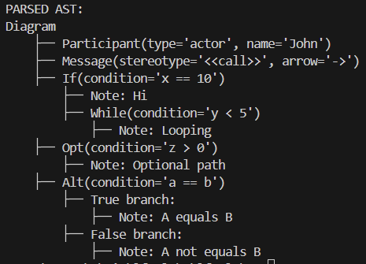

# Chomsky Normal Form
**Course**: Formal Languages & Finite Automata  
**Author**: Loredana Costin

---

## Theory

The parser is responsible for reading the tokens from the lexer and producing the parse-tree. It gets the next token from the lexer, analyzes it, and compare it against a defined grammar. Then decides which of the grammar rule should be considered, and continue to parse according to the grammar. 

Key Concepts of Parsers:
- Lexical Analysis: The process of breaking the source code into a sequence of tokens (keywords, operators, literals, etc.). This is typically done by a lexer (lexical analyzer).
- Syntactic Analysis: The parser uses the tokens produced by the lexer to check if the code follows the syntax rules of the programming language. If the code is syntactically correct, the parser builds the AST.

Types of parsers:
- Top-Down Parsers (Recursive Descent Parsers): These parsers begin with the start symbol of the grammar and recursively try to match each production rule in the grammar. They break the input into smaller chunks based on the expected structure. Therefore, it is simple to implement and directly the grammar's structure. The disadvantage is that is may struggle with certain types of grammars (e.g., left-recursive grammars).
- Bottom-Up Parsers (Shift-Reduce Parsers): Bottom-up parsers work by attempting to reduce sequences of input tokens to higher-level constructs based on grammar rules. They start with the tokens and gradually build up to the start symbol. It can also handle more complex grammars. However, it is more complex to implement than top-down parsers. 
- LL Parsers (Left-to-right, Leftmost derivation): LL parsers read the input from left to right and use the leftmost derivation in their parsing process. These are a subset of top-down parsers.
- LR Parsers (Left-to-right, Rightmost derivation): LR parsers also read the input from left to right, but they make parsing decisions based on the rightmost derivation.

An Abstract Syntax Tree (AST) is a tree-like data structure used in compilers and interpreters to represent the syntactic structure of source code. It is an abstraction of the parse tree, where every node represents a construct in the language (e.g., expressions, statements, variables, or other elements).

Key concepts of AST:
-  The AST abstracts away unnecessary details like punctuation or formatting, focusing only on the logical structure of the code.
- ach node in the AST represents a specific construct, such as a statement, expression, or control flow structure.
- Parent-Child Relationship: In the tree, each node may have children (sub-expressions or statements). For instance, an If node would have a child representing the condition and potentially other children for the body of the if and else statements.
- Simplicity: ASTs are designed to capture the essential structure of the code without extraneous details. For instance, the if statement in source code would be represented by a node with a condition and a body, but without braces or other syntactic markers.

Advantages of AST:
- **Simplification**: It removes unnecessary syntax and only represents the logical structure of the code.
- **Ease of Analysis**: It is easy to analyze, modify, or optimize the structure since it abstracts away the syntactic details.
- **Facilitates Translation**: ASTs are a stepping stone for translating source code into machine code or bytecode.
---

## Objectives:

- Get familiar with parsing, what it is and how it can be programmed.
- Get familiar with the concept of AST
- In addition to what has been done in the 3rd lab work do the following:
    a. Have a type TokenType (like an enum) that can be used in the lexical analysis to categorize the tokens.
    b. Please use regular expressions to identify the type of the token.
    c. Implement the necessary data structures for an AST that could be used for the text you have processed in the 3rd lab work.
    d. Implement a simple parser program that could extract the syntactic information from the input text.
---

## Implementation Description

1. **AST construction**
Each construct (such as a participant, message, or block) is represented by a specific type of AST node. These nodes are defined by classes, such as Participant, Message, IfBlock, etc. These classes are linked together to form a tree structure.
For instance, an IfBlock node might contain the condition and a list of statements in its body. The tree structure of the parsed code is built recursively:

```python
class IfBlock(ASTNode):
    def __init__(self, condition, body):
        self.condition = condition
        self.body = body
```
This class represents an if block, where condition holds the condition string (e.g., "x == 10") and body is a list of statements that are executed if the condition is true.
Similarly, other classes like Participant and Message represent different elements in the sequence diagram:

```python
class Participant(ASTNode):
    def __init__(self, p_type, name):
        self.p_type = p_type
        self.name = name

class Message(ASTNode):
    def __init__(self, stereotype, arrow):
        self.stereotype = stereotype
        self.arrow = arrow
```

2. **Parser**

This part shows a recursive descent parser for sequence diagrams that first checks for the required "sequence" keyword at the beginning. It then iterates through tokens, identifying different diagram elements (participants, messages, control structures like if/while/opt/alt blocks, and notes) based on their token types and values. For each recognized element, it calls the appropriate specialized parsing method and adds the resulting AST node to an elements list. Finally, it returns a Diagram object containing all parsed elements, which represents the complete abstract syntax tree of the sequence diagram.

```python
def parse(self):
        elements = []
        if not self.match(TokenType.DIAGRAM_KEYWORD):
            raise SyntaxError("Expected 'sequence' keyword at the beginning")

        while self.current():
            if self.current().type == TokenType.PARTICIPANT_TYPE:
                elements.append(self.parse_participant())
            elif self.current().type == TokenType.STEREOTYPE:
                elements.append(self.parse_message())
            elif self.current().type == TokenType.KEYWORD and self.current().value == 'if':
                elements.append(self.parse_if())
            elif self.current().type == TokenType.KEYWORD and self.current().value == 'note':
                elements.append(self.parse_note())
            elif self.current().type == TokenType.KEYWORD and self.current().value == 'while':
                elements.append(self.parse_while())
            elif self.current().type == TokenType.KEYWORD and self.current().value == 'opt':
                elements.append(self.parse_opt())
            elif self.current().type == TokenType.KEYWORD and self.current().value == 'alt':
                elements.append(self.parse_alt())
            else:
                self.pos += 1

        return Diagram(elements)
```

Below, it is showed the participant declaration in a sequence diagram by first matching and extracting a participant type token (like "actor" or "boundary"). It then matches and extracts an identifier token that represents the participant's name. Finally, it returns a new Participant AST node initialized with both the type and name values, which becomes part of the diagram's element collection in the main parse method.

```python
def parse_participant(self):
        p_type = self.match(TokenType.PARTICIPANT_TYPE).value
        name = self.match(TokenType.IDENTIFIER).value
        return Participant(p_type, name)
```
The parse_if method in the recursive decent Parser class matches the "if" keyword, parses the condition inside parentheses, and then parses the block body recursively. It showcases the core mechanism of a recursive descent parser.

```python
def parse_if(self):
    self.match(TokenType.KEYWORD)  # 'if'
    self.match(TokenType.PUNCTUATION)  # '('
    condition = []
    while self.current() and self.current().type != TokenType.PUNCTUATION:
        condition.append(self.current().value)
        self.pos += 1
    self.match(TokenType.PUNCTUATION)  # ')'
    self.match(TokenType.PUNCTUATION)  # '{'

    body = self.parse_block_body()  # Parse the body of the if block
    self.match(TokenType.PUNCTUATION)  # '}'

    return IfBlock(' '.join(condition), body)
```

The parser first matches the if keyword and its subsequent condition inside parentheses. It then parses the body of the if block, which can contain further statements or nested blocks. Finally, the parser matches the closing brace (`}`) to complete the block and returns an IfBlock object, which will hold the condition and the body of the if statement.
This pattern is replicated for other constructs like while loops, optional blocks (opt), and alternative blocks (alt), all of which are modeled by specific AST node types, such as WhileBlock, OptBlock, and AltBlock.

---
## Results and Conclusion


In conclusion, I can say that the parser works as intended. By combining lexical analysis with  parsing, the program translates structured diagram descriptions into a tree-based internal representation that captures the logical flow and elements of the diagram. All these are due to well-defined token types, using regular expressions for token recognition, and implementing node classes for AST file. This made the parser be easily extended, and logically clear. Each parser method focuses on one thing, keeping it clean and without ambiguity.


---
## References  

1. **Online Resources:**  
   - [Medium- Writing a Parser](https://supunsetunga.medium.com/writing-a-parser-getting-started-44ba70bb6cc9)  
   - [Medium- Leveling Up One’s Parsing Game With ASTs](https://medium.com/basecs/leveling-up-ones-parsing-game-with-asts-d7a6fc2400ff)  
   -  [Youtube- Building a Parser from scratch](https://www.youtube.com/watch?v=4m7ubrdbWQU&t=4s&ab_channel=DmitrySoshnikov)

2. **Books and Slides:**  
   - [Automata Theory, Languages, & Computation - 3rd Edition (PDF)](https://mrce.in/ebooks/Automata%20Theory,%20Languages,%20&%20Computation%20Introduction%203rd%20Ed.pdf)  
   - [Course Slides (Google Drive)](https://drive.google.com/file/d/19muyiabGeGaoNDK-7PeuzYYDe6_c0e-t/view)  
